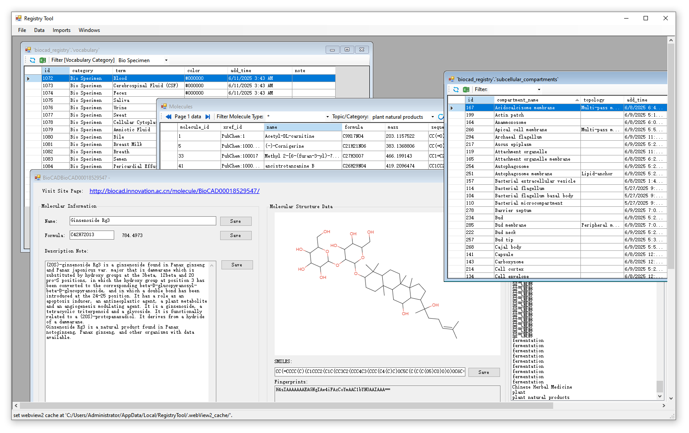

# Database system for access the GCModeller cloud repository

An in-house data repository system for GCModeller make reconstruction of the GMM(genome-wide metabolic model).



## registry database schema 

```
┌─────────────────┐
│ vocabulary      │ ◄───────┐
│ (术语表)         │        │
└────────┬────────┘         │
         │                  │ (定义实体类型)
         │                  │
    ┌────▼─────────────+────+─────────────┐
    │                  │                  │
┌───▼────┐    ┌────────▼───┐       ┌──────▼────┐
│ entity │    │ reaction   │       │  regulator│
│ types  │    │ roles      │       │   roles   │
└────────┘    └────────────┘       └───────────┘
      │               │                    │
      │               │                    │
      │     ┌─────────┴───────┐            │
      │     │                 │            │
  ┌───▼─▼───▼───┐      ┌──────▼────────────▼───┐
  │   四大实体   │      │    核心网络表          │
  ├─────────────┤      ├───────────────────────┤
  │ metabolites │      │ metabolic_network     │
  │ gene        │      │ regulatory_network    │
  │ protein     │      │ pathway_network       │
  │ reaction    │      │ complex               │
  └──────┬──────┘      └───────────────────────┘
         │                     │
         │                     │
         │    ┌────────────────┴─────────────┐
         │    │                              │
    ┌────▼────▼────┐              ┌──────────▼──────────┐
    │  辅助数据表   │              │   映射/索引表        │
    ├──────────────┤              ├─────────────────────┤
    │ struct_data  │              │ registry_resolver   │
    │ pdb          │              │ db_xrefs            │
    │ nucleotide   │              │ synonym             │
    │ protein_data │              │ ontology            │
    └──────────────┘              └─────────────────────┘

```


+ https://gcmodeller.org/ 2016-2026. All rights reserved.
+ biocad_registry.innovation.ac.cn 2026. All rights reserved.
