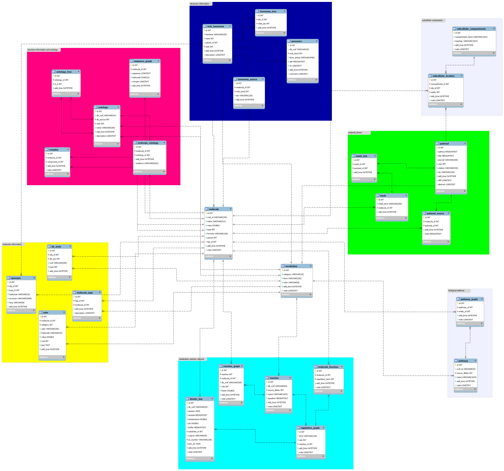

# Database system for access the GCModeller cloud repository

A data repository system for GCModeller make reconstruction of the GMM(genome-wide metabolic model).

## Build database 

1. imports ChEBI database
2. imports Rhea reaction database
3. imports Pubchem database
4. imports uniprot database
5. imports genbank database file

+ https://gcmodeller.org/ 2023. All rights reserved.
+ https://biocad.cloud/ 2024. All rights reserved.
